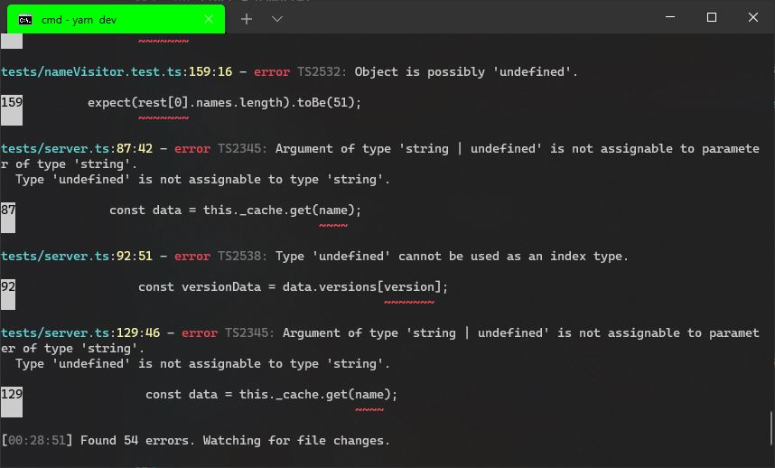

## Introduction

I'm a huge fan of `TypeScript`. I think it must have been around 2015. When I also found out that the project is led by [Anders Hejlsberg](https://en.wikipedia.org/wiki/Anders_Hejlsberg) it solidified my quick judgement only further :sweat_smile:

Anders co-designd several programming languages, among them `C#` which I highly like since it offers a great developer experience and it's just a pleasure to work with. So it was a no brainer to also follow this project and I've been happy working with it ever since.

So whenever there's a new `TypeScript` release with a new setting that would improve the type safety further, I'm eager to try it out.

So I did with the `noUncheckedIndexedAccess` setting which was added in 4.1.

<!--truncate-->

## Status Quo

While the project is already making use of the `strict` compile setting, `noUncheckedIndexedAccess` needs to be added manually as it's not part of the `strict` rule family.

### `noUncheckedIndexedAccess`

In short this setting makes accessing items in an array stricter.
Even with the `strict` setting, the following code will not error even though it should!.

```typescript
let names: string[] = []; //empty array
let first = names[0];

first.toUpperCase(); //no error!
```

In this case, `first` is actually `undefined` so calling `first.toUpperCase()` will result in a runtime exception, not good.

By turning on `noUncheckedIndexedAccess` this particular code will now error as expected:

```typescript
let names: string[] = [];
let first = names[0];

first.toUpperCase(); //Object is possibly 'undefined'.
```

So to access this variable properly it now needs a dedicated check:

```typescript
let names: string[] = [];
let first = names[0];

if (first) first.toUpperCase(); //all good now
```

Since this setting can be rather noisy it's not included in the default settings for `strict`;

### First test run

So lets turn it on for our code:



54 errors, quite some.

But if we look closely most of them are actually coming from the unit tests like:

```bash
tests/nameVisitor.test.ts:158:16 - error TS2532: Object is possibly 'undefined'.

158         expect(rest[0].license).toBe("ISC");
                   ~~~~~~~
```

While in this case I could satifisy the compiler quite nicely with optional chaining:

```typescript
expect(rest[0].license)!.toBe("ISC");
```

More work would be required if destructuring is used:

```bash
tests/nameVisitor.test.ts:153:18 - error TS2339: Property 'license' does not exist on type '{ license: string; names: string[]; } | undefined'.

153         const [{ license, names }, ...rest] = new LicenseUtilities(p).licensesByGroup;
                     ~~~~~~~
```

Since I didn't feel like this setting is particularily useful for unit tests where you have defined inputs and you're looking for the expected output, I thought maybe there's a way I can apply `noUncheckedIndexedAccess` only to the actual source code. Turns out there's a way!

### Current setup

The project setup is fairly simple, there is a single `tsconfig.json` which includes the `src` and `tests` folders.

But that also means that compile settings are shared.

And just as you can import code from `src` into `tests` for your unit tests, you can do the opposite as well, which doesn't really make sense.

One naive solution would be to create 2 `TypeScript` projects one in the `src` folder and one in `tests` but that also means to start the `TypeScript` compiler 2x :grimacing:

Luckily `TypeScript` already provides a solution to that problem, namely [Project References](https://www.typescriptlang.org/docs/handbook/project-references.html).

## Project References

With project references I can selective enable different compile settings for different folders of my project.

This allows me to setup `src` in a way that I cannot accidentally import anything from `tests`, while `tests` itself can import stuff from `src`.

If the unit tests are compiled, it will look where the import is from and apply different compile settings, anything that is imported from the `src` folder will be compiled with `noUncheckedIndexedAccess` while everything under `tests` will be compiled like always.

Best of it is that I don't need 2 separate `TypeScript` processes for it, I still only need to start the `TypeScript` compiler once.

I just have to tell `TypeScript` that I'm using project references:

```bash
#old
tsc --watch

#new
tsc --watch --build
```

## Conversion

The actual code conversion was straight forward, adding missing `undefined` checks. But it also surfaced some questionable design decisions that I did in the past.

E.g. there's functionality to return the most referenced packages in the dependency tree. But the data structure was quite weird:

```typescript
type MostReferred = [string, number][];
```

An array of `[string, number]` tuples, where `string` is the package name and `number` is the reference count, it would look like this:

```typescript
let mostReferred = [
  ["react", 3],
  ["chalk", 3],
  ["lodash", 3],
];
```

But the number, which specifies the reference count would be the same for all tuples in the array, so there is really no need to specify it for every tuple. Furthermore I used to use the reference count from the very first entry as the displayed value like:

```typescript
const [, count] = mostReferred[0];
```

Which of course now errors, because it rightfully might be `undefined` if the array is empty aka a package doesn't have any dependencies. No dependencies = no referenced packages.

So instead of fixing this error by checking yet again for `undefined` I decided to change the data structure altogether, so I don't need to destructure an array:

```typescript
//refactored data structure
export interface IMostReferred {
  pkgs: string[];
  count: number;
}
```

Now I can get the count by simply doing `mostReferred.count` and all the packages are in a simple `string` array 🙌.

## Final Setup

So how did I enable different compile settings for different folders in the project?

Quite simple actually:

### Top level `tsconfig.json`

The first change was to convert the existing `tsconfig.json` to a "top level tsconfig", that simply points to other tsconfigs:

```typescript
{
    "compilerOptions": {
        //...same compiler options as before
    },
    "include": [],
    "references": [
        { "path": "./src" },
        { "path": "./tests" }
    ]
}
```

Note the empty `include`. This tsconfig doesn't compile anything, it just references other `tsconfig.json` locations. The `path` needs to point to a `tsconfig.json` file or a folder where it then looks for a `tsconfig.json` (like above).

### `./src/tsconfig.json`

In the `src` folder I created a new `tsconfig.json` as follows:

```typescript
{
    "extends": "..",
    "compilerOptions": {
        "composite": true,
        "noUncheckedIndexedAccess": true
    },
    "include": ["./**/*.ts"]
}
```

`extends` tells the compiler to take the `compilerOptions` from the top level `tsconfig.json` that is, the same compile settings that have been enabled so far and merge them with the `compilerOptions` from this `tsconfig.json`.

`composite` tells `TypeScript` that this is a project reference and is a requirement to set.

Finally here we enable `noUncheckedIndexedAccess` and tell via `include` to apply these settings for every `.ts` file that is in a subfolder.

### `./tests/tsconfig.json`

We do the same again for the `tests` folder:

```typescript
{
    "extends": "..",
    "compilerOptions": {
        "composite": true
    },
    "include": ["./**/*.ts"],
    "references": [
        { "path": "../src" }
    ]
}
```

The only difference here is that we reference the `tsconfig.json` in the `src` folder, otherwise we wouldn't be able to import code from there.

### Compiling

Finally to compile the project you need to invoke TypeScript (on the top level, like before) with the `-b` or `--build` option as it is now using project references.

```bash
# before
tsc

# after
tsc --build
```

And that was all that was needed to compile files with different settings in the same project.

Everything still works as it used to 🙌:

- Still 1 command to compile everything
- Changes in `src` still highlight errors in `tests`
- Codelens still shows usage in `src` and `tests`
- No more recompile for `tests` when changing internals in `src`

Overall pretty smooth change given that I never worked with project references before and therefore expected a bumpier road or at least some compromises but everything works as before. Kudos to the TypeScript team.
