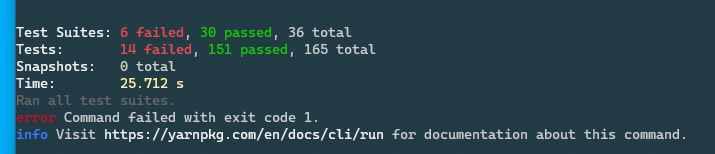
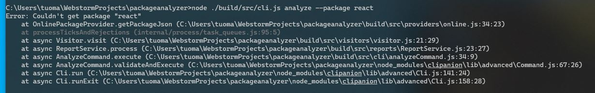
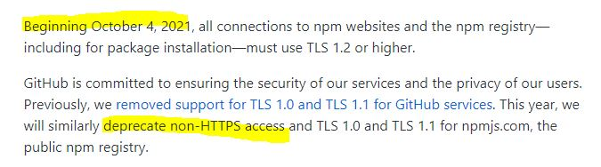
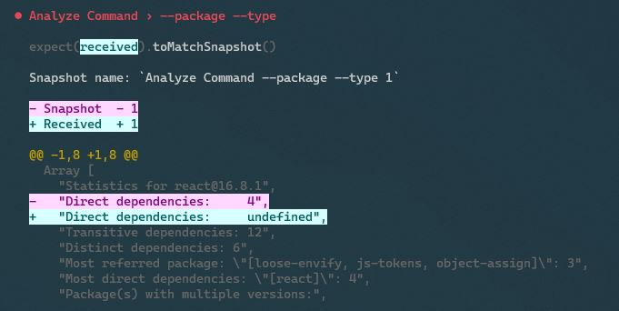
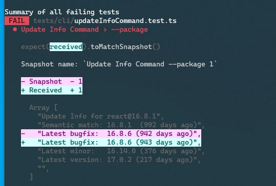
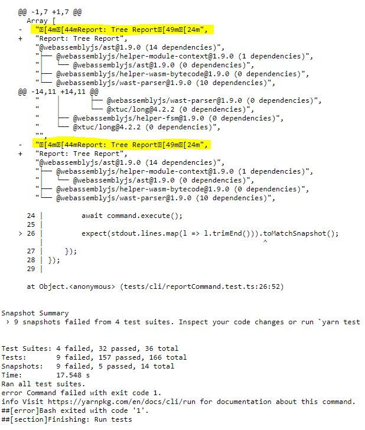

## Introduction
In this edition I'll talk about how the project crashed and burned (also the unit tests) while I was on vacation in 🇨🇴 and also how I test the CLI for the correct output.
<!--truncate-->
## Colombia
I spent the whole month of September in Colombia. Why? Because it's fucking awesome!


I know, if you've never been there you might think wtf Colombia u crazy? This was also the response from my parents the first time I was going to visit but. But that has since turned to an enjoy, and don't forget our coffee!

Contrary to the media, if you dare to visit you'll find one of the most welcoming people, they really go out of their way to help you.

Like this time I was going to the bus terminal to take a specific bus, unfortunately that bus wasn't available but I could take another bus that was passing through where I wanted to go, they could drop me off there, I just need to tell the bus driver to let me out. However as soon as I entered the bus terminal I was asked (by a random man, he had normal clothes on) where I wanted to go, was guided to the right ticket booth and the same guy came back shortly before departure to tell the bus driver where I wanted to go to make sure I end up where I wanted to go. The best thing, I speak Spanish, I could have done it without his help, yet he still came trough to help me.

Or one time I was buying a jacket for my mum but didn't know if it was the right size. The sales lady simply put on the jacket herself to help me decide since I told her earlier that she and my mum are similar in size. That's just the kind of hospitality that you get. Just thinking about those encounters makes me want to go back.

What's more, Colombia is pretty diverse so their cuisine is really varied, if you like food there's a lot to try, oh boy.

I basically spent every day eating awesome Colombian food like Empanadas, Arepas (sorry 🇻🇪, no me pegan porfa), Salchipapas, Mojarra Frita, Carne Oreada, Carne Mamona, Carimañola.

Having always been received well in Colombia I wanted to take this opportunity give something back by briefly sharing my experiences. Don't get me wrong there are still a lot of problems in Colombia but hospitality is not one of them.

As far as programming went my plan was to not do any of it. 1 month no programming.

## Everything broke

However several days into my vacation I thought maybe lets check out the code and see what I could work on next when I get home.

So I fired up my Surface Go, which is my favorite on the go device. pulled the latest changes, installed dependencies, ran unit tests and... they fail.



As much as I like the Go for its form factor and real windows, it's also slow (iPad MacOS when?).
So maybe the Go hit a timeout (which happenend before). But no, it didn't fail because of a timeout error.

What's even stranger is that dependabot PR's in Github ran fine, yet it fails on my machine.
Furthermore if I used the `packageanalyzer` at all it would fail... strange.

//todo update


The error message was that it cannot resolve the dependencies. Weird, maybe the internet connection of the hotel is blocking NPM but why could it install the dependencies just fine?

Anyway since I was on vacation and I didn't plan on doing any sort of programming, let alone debugging I left it at that. However I did check dependabot for new PR's. Surprisingly they would now also fail. That's at least something, a common ground.

When I came back from vacation(remember 1 month no code) I looked at it again and I remember vaguely that Github announced that it will deprecate `http` access to NPM.



And sure enough, this was the problem. The packageanalzyer was accessing NPM via `http`. Switching to `https` fixed the problem. The packageanalyzer now works again.

All I had to do was literally replace all NPM `http` urls in the code with `https`.


Done.

### Enforcing url syntax
This was also a good opportunity to checkout TypeScripts [`Template Literal Types`](https://www.typescriptlang.org/docs/handbook/2/template-literal-types.html).
With this you can actually define the format of your strings.
Previously I had no good use case for them but thought they could help here, so I tried them.

Previously the function to make http(s) requests (which was used to make the calls to NPM) was using a `string` argument to define the url:
```typescript
function download(url: string): Promise<string> {
    //...
}
```
However in theory you could call it with any `string`:
```typescript
download("abc");
download("");
```
These are clearly not urls and there was nothing that TypeScript could do to help you.

But with `Template Literal Types` you can limit strings to a certain format:
```typescript
export type Url = `https://${string}`;
```
So if we change the signature to use this new type instead of `string`:
```typescript
function download(url: Url): Promise<string> {
    //...
}
```
the above invocations will now error:
```typescript
download("abc");    //Argument of type '"abc"' is not assignable to parameter of type '`http://${string}`'.
download("");       //Argument of type '""' is not assignable to parameter of type '`http://${string}`'.
```
While any string starting with `https://` will be ok
```typescript
download("https://registry.npmjs.com");  //ok
```

Now why is this type even dynamic? Why not hardcode the type to `https://registry.npmjs.com`?
Because the NPM registry is just the default, the idea is that you can use any registry. So with this in mind a new `Url` type was created with the goal of replacing the `string` type in the request signature. Only allowing strings that would start with `http://` or `https://`.
```typescript
export type Url = `http://${string}` | `https://${string}`;
```
### Making the unit tests offline capable
So everything worked again, but why did the unit tests break in the first place? Special care was taken to not make them rely on online connectivity.

In fact the tests for the download count still relied on an online connectivity as it was accessing the NPM registry directly. Luckily all the data that was needed for the test was already available in the test data directory and the test would just need to make use of the Mock Server instead of the real NPM registry.

However making this work yielded a rather unsatisfying developer experience...

## Improving the `Reports` developer experience
The `Reports` mechanism is supposed to be the cornerstone of extensibility for the `packageanalyzer`.
If you want to extend the feature set of the `packageanalyzer` you would do it via the `Reports` mechanism so it's important to get it right.

What's more, every built in feature also uses this very same mechanism, both because 1st there is no reason why there should be 2 separate implementations and 2nd it's a nice way to validate the usefulness, which in this case it showed that it's rather clumsy to use, partly because how it was setup with TypeScript.

There's an `IReport` interface that you can implement to extend the `packageanalzyer`. This interface looks roughly like this:
```typescript
export interface IReport {
    readonly provider?: IPackageJsonProvider;
    //...
    report(pkg: Package, formatter: IFormatter): Promise<void>;
}
```
A `report` method that gets called once the dependency tree was looked up, its basically `main`. `pkg` gives you access to the whole dependency tree and `formatter` lets you write out to the console.

But you can also specify a custom `provider`. The provider is used during the dependency lookup stage to fetch metadata about a particular package. If not specified it will default to NPM.

That's what happened for the `DownloadCountReport`, the unit test didn't set this value thus it defaulted to NPM, which then made the tests fail because it was doing so via `http` and Github removed `http` support.

So it should be easy, just set this value in the unit test and done? Well this was the idea with the `IReport` interface but it didn't turn out to be that easy.

Here's why:
The idea was to implement the IReport interface and be done with it.
```typescript
export class DownloadReport implements IReport {
    async report(pkg: Package, formatter: IFormatter): Promise<void> {
        //...
    } 
}
```
This is a proper implementation, however if we try to access the `provider` we get hit with an error:
```typescript
const downloadReport = new DownloadReport();

downloadReport.provider = new MockDownloadProvider(); //Property 'provider' does not exist on type 'DownloadReport'.
```
It doesn't know anything about the `provider` property :/

So in order to fix this we have to specify the `provider` in the `DownloadReport` class "again":
```typescript
export class DownloadReport implements IReport {
    provider?: IPackageJsonProvider;

    async report(pkg: Package, formatter: IFormatter): Promise<void> {
        //...
    } 
}
```
A little redundant, or at least not the developer experience that I was aiming for. Every `Report` that wants to specify their own `provider` they would need to re-specify it in the class... but the goal was to have it provided automatically.

Also there are more options that you could potentionally specify like dependency depth, which kind of dependencies (`devDependencies`, `peerDependencies`) etc. This would quickly snowball.

### Solution
Instead of implementing the interface, you now extend from an `abstract` Report class:
```typescript
abstract class AbstractReport implements IReport {
    provider: IPackageJsonProvider | undefined;

    abstract report(pkg: Package, formatter: IFormatter): Promise<void>;
}
```
the `DownloadReport` would then only need look like this:
```typescript
export class DownloadReport extends AbstractReport {
    async report(pkg: Package, formatter: IFormatter): Promise<void> {
        //...
    } 
}
```
No need to re-specify any optional properties 🙌

And then down the line you can freely assign a custom provider:
```typescript
const downloadReport = new DownloadReport();

downloadReport.provider = new MockDownloadProvider(); //ok
```

## Testing the CLI output
Up until now the unit tests didn't check the output of the CLI, it only checked that it didn't crash or sometimes it looked for a specific line count.

Naturally during the course of the development some variable got lost and when printed out it would show `undefined`. Not ideal, the only way to combat this is to really look at the content that was output.

[todo undefined error]

So I was looking for a system that would collect the CLI output, save it and then in the future compare the CLI output with this saved output from earlier, if they match, everything is ok, if not, something changed or most likely broke. Anyway it's not the same and needs manual review.

I thought, man, this is a lot of work, first I need a mechanism to collect the CLI output. Luckily this was easy as the `packageanalyzer` was already designed with this flexibility in mind, so getting this data was actually easy. But then I needed a way to save the output, a way to load it into the unit tests and also a way to update them. A lot of work. So nothing was done in this area, until last month I had an epiphany.

Can I repurpose Jest snapshots to test the CLI output? All the things that I need to do in order to test the output was already being done by Jest snapshots, only that they are typically used to test React components...

So I set out on a mission: Only the mission didn't even start because I saw right away in the snapshot documentation that it will be possible. Jest snapshots work React independent. You simply hand the snapshot mechanism some JSON, it will be serialized and written to the filesystem. On the next run it will be loaded automatically and used for comparison. Done.

Since I already had the CLI output in form of a `string[]`, I handed this to the snaphsot mechanism and done 😅
```typescript
expect(stdout.lines).toMatchSnapshot();
```
Full snapshot testing for the CLI output.



Everything worked fine, or did it?

### Not so fast
After this test proved successfull, I called it a day. Next day I ran the unit tests... and they fail?


The nice thing about using Jest for the snapshots instead of a homegrown solution is that you get a nice diff view at no extra charge.

So the test failed because it contains a date span, which obviously is not correct anymore 1 day later.

In order to fix this I need to run Jest with a fixed date, luckily this is super easy:
```javascript
//jest.config.js
module.exports = {
    //...
    timers: "modern"
    //...
}
```
```typescript
//foo.test.ts
beforeAll(async () => {
    jest.setSystemTime(new Date(`2021-10-26`).getTime());
});

//tests...

afterAll(async () => {
    jest.useRealTimers();
});
```

So now the tests run with a fixed date, time to push it to CI...
And they fail on CI.



If you look closely there are weird characters in the first line. The first line is coming from the snapshot and these are unicode characters because I'm using `chalk` to color the output.

For some reason on the Azure CI those unicode characters are getting stripped... :/

As I couldn't find anything useful online I went the route of stripping the unicode characters myself before the snapshot is taken.

With this measurement, the unit tests also now pass on CI 🙌
[pic of passed azure ci]

***
And with that, this edition of the #devblog has come to an end.

If you liked what you read you might want to follow me on [Twitter](https://twitter.com/tmkndev) to get notified about new #devblogs.

Or if you want to contribute to the project you can find the GitHub project [here](https://github.com/tmkn/packageanalyzer).