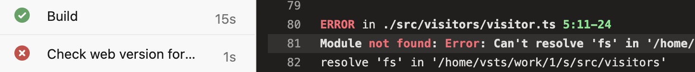
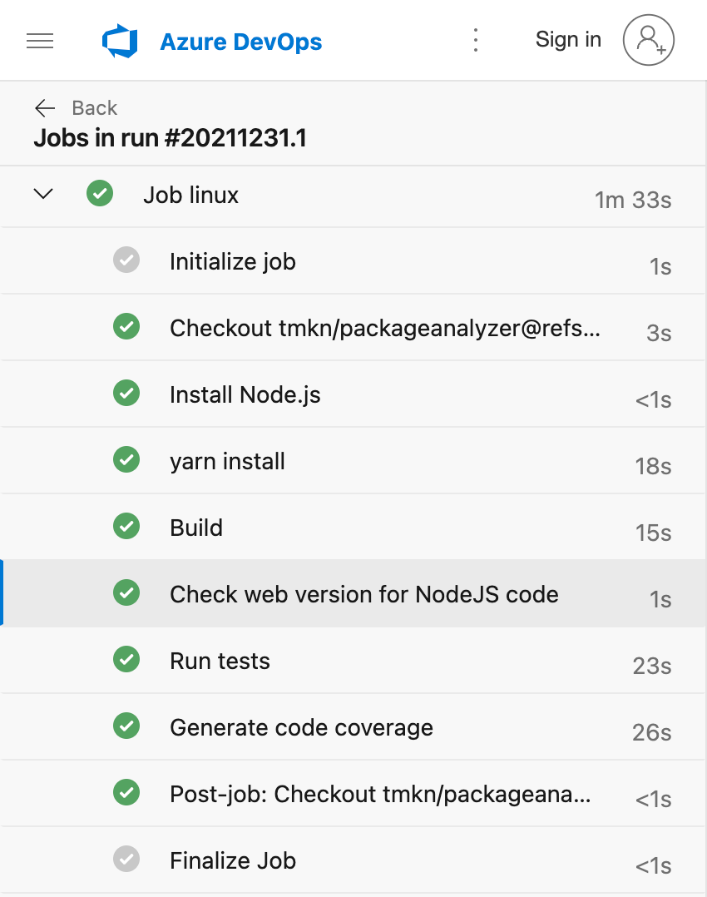
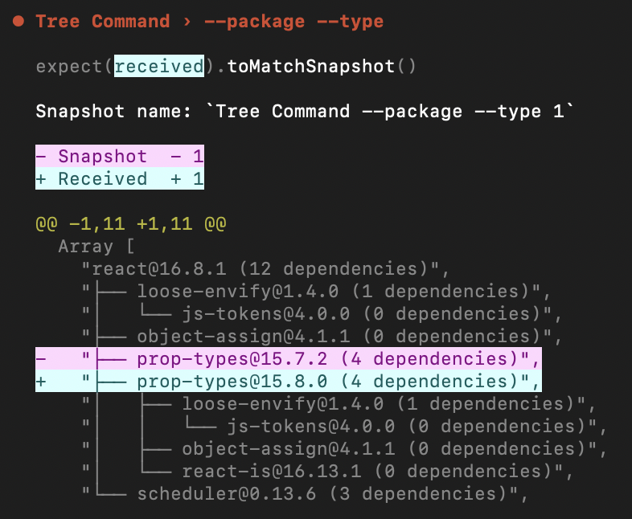
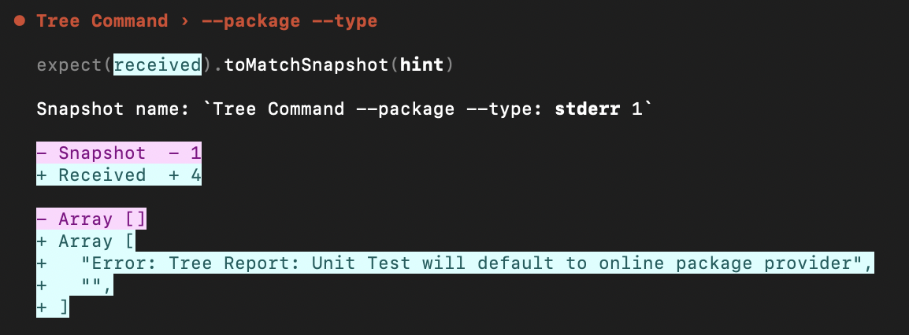

## Introduction

Last devblog of the year 🙃

In this edition I'll talk about the work that has begun to make the packageanalyzer browser compatible and how the unit tests suddenly broke yet again without having done any changes.

Lastly a recap what is missing for v1 in 2022.

<!--truncate-->

:::info
This devblog is about the `packageanalyzer` project.

_A framework to introspect Node.js packages._

Please find a short introduction and the motivation for this project [here](/docs/intro).
:::

## Browser compatibility

The great thing about JavaScript is that it also runs in the browser. 🙃

Much of the functionality of the packageanalyzer is not dependent on Node.js. So it should be possible to make it work in the browser.

Why? Because I have an idea for a new web project. There will be more info about it once I have something to show but to realize this idea I need (parts of) the packageanalyzer working in a browser first.

### The challenge

The main challenge was actually only making sure that no Node.js specific libraries/code ends up in the web version.
Since Node.js and browsers both understand JavaScript there was no additional complexity needed to make the browser understand the code.

You would just need to make sure there is no Node.js specific code in the browser version. To do this I opted to use webpack.

### Webpack

I actually haven't used `webpack` in this project so far. I just used `TypeScript` to create the required files.

`Webpack` provides different bundling modes, you can tell it to create a Node.js bundle or a web bundle. In the case of the web bundle it will error when it encounters Node.js specific code.

Exactly what I needed!

However I will still use `TypeScript` to create the actual files, I will only use `webpack` to create a (fictitious) bundle in memory to check if there are Node.js specific imports. If there are no such imports I let `TypeScript` then create the actual files.

### Setup

First I created a `web.index.ts` file which acts as the entry point for the web version by exporting the code that should be browser safe:

```typescript
//web.index.ts
export { Package } from "./package/package";
//...
```

Then I declared this entry point in the `package.json`:

```json
//package.json
{
    //...
    "exports": {
        "./web": "./build/src/index.web.js"
    }
    //...
}
```

So now the web version can be consumed in code via:

```javascript
import { Package } from "@tmkn/packageanalyzer/web";
```

To make `TypeScript` type definitions work, this also needed to be added to the `package.json`:

```json
//package.json
{
    //...
    "typesVersions": {
        "*": {
            "web": ["./build/src/index.web.d.ts"]
        }
    }
    //...
}
```

Then I used `webpack`'s API to check for those Node.js specific imports:

```javascript
//webpack.web.config.js
const webpack = require("webpack");
const MemoryFileSystem = require("memory-fs");

const memoryFs = new MemoryFileSystem();
const compiler = webpack({
    entry: "./src/index.web.ts",
    mode: "development",
    target: "web"
    //...
});

compiler.outputFileSystem = memoryFs;

compiler.run((err, stats) => {
    //check for any errors here
});
```

The magic is `target: web` and `compiler.outputFileSystem = memoryFs;` which makes it compile in memory.

Now I can run `node ./webpack.web.config.js` and immediately get info whether the web version is using any Node.js specific code.

All that's left to do is hook it up to the CI pipeline:

```json
//package.json
{
    "scripts": {
        "lint:web": "node ./webpack.web.config.js"
    }
}
```

```yml
#azure-pipelines.yml
- script: yarn lint:web
  displayName: "Check web version for Node.js code"
```

### Results

If there is Node.js specific code in the web version the CI will fail:

Here in `visitor.ts` a Node.js specific import was found: `fs`;

But if not, everything is green and thus can be used in the browser.


## Unit tests broke (again)

Last week dependabot PR's started to fail out of the blue. This happened before and the reason was that some of the tests didn't rely on mock data but actual live data from NPM.

The errors all looked alike, they were all related to `prop-types` being another version than expected.

Here's how 1 of the failing tests looked like for printing the dependency tree for `react@16.8.1`:

Here `prop-types@15.7.2` was expected but `prop-types@15.8.0` was received.

### Cause

After a qick investigation I found out that `prop-types@15.8.0` was released on December 22 aka last week. Since the unit tests predate this date it looks like the unit tests were still pulling in live data rather than mock data 😬

So the last week was spent fixing the unit tests(again).

### Fix

To better remedy against this in the future, the unit tests now not only look at the `stdout` output but also at the `stderr` output.

Additionally, if in the future a unit test will use live data it will write a message to `stderr` which will fail the test since under normal circumstances we expect `stderr` to be empty:


Here we can deduct that `stderr` received an entry which shouldn't have been there. Additionally the error message gives us a better indication of what went wrong 🙌

## Road to v1

The only thing missing from a `v1` is an improved developer experience. If you use custom `Reports` it should tell you what parameters are missing or wrong. This type of dx is not yet there but I feel this is crucial to have. Otherwise I'm pretty happy with how it turned out.

I tried to use JSON schema but it was not really intuitive/overkill for what I wanted. Looks like I will have to roll my own.
