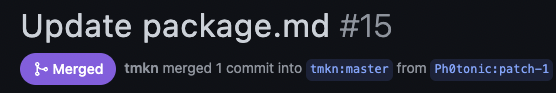
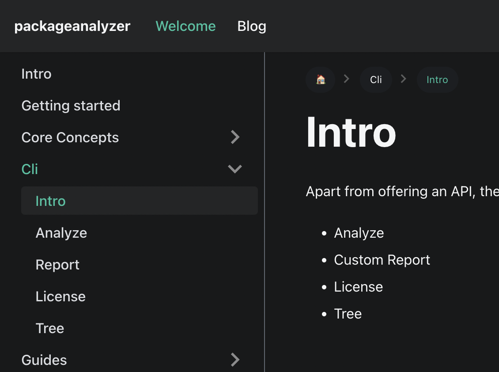
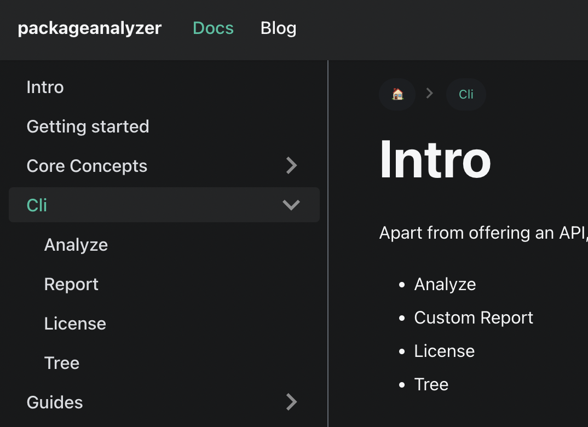

## Introduction
The beginning of the year saw limited work being done that's also why this devblog comes later than usual as I waited for things to accumulate. Without further ado, here's what's happened: A validation feature was added to the `Reports` class, code was removed due to low usage and the documentation received various updates.

Also the documentation received its first external pull request 👏
<!--truncate-->

## Validation for `Reports`
To make `Reports` more bullet proof, work was done on validating input data. This data is used to initialize a `Report`.

While working with `TypeScript`, the compiler does already a good job in making sure only the expected data is passed in. However the project is also meant to be used with `JavaScript`. In this case it needs client side validation.

To satisfy both runtime and build time validation I was looking for a library that could do both.

That's when I stumbled upon [io-ts](https://github.com/gcanti/io-ts).

According to the GitHub repo it's a:
> Runtime type system for IO decoding/encoding

The nice thing is as you create the runtime validation code it will automatically generate appropriate `TypeScript` types.

### Before
This example shows the input data for the Loops command.

There used to be just an interface describing the input data e.g.
```typescript
export interface ILoopParams {
    package: string;
    type: DependencyTypes; // "dependencies" | "devDependencies"
}
```
then later on in the `report` method it would be validated like:
```typescript
        if (!isValidDependencyType(this.type)) {
            throw new Error(
                `Please only specify "dependencies" or "devDependencies" for the --type argument`
            );
        }
```
That caused a little bit of friction as interface declaration and runtime check are completely separated. With `io-ts` it's possible to generate the `interface` automatically.

### Now
```typescript
const LoopParams = t.intersection([BasePackageParameter, TypeParameter]);

export type ILoopParams = t.TypeOf<typeof LoopParams>;
```
Now this can look daunting but the gist is that `t.intersection` allows me to compose an object where I can specify the validation for each key.

Then `t.TypeOf` allows me to generate the interface automatically, it is the very same `ILoopsParams` interface as in the *Before* example.

To make use of the validation a optional method `validate` was added to the `Report` class. Optional to allow for quick iteration with `Reports`.

All you need to do is return the validation object, in this case `LoopParams`:
```typescript
    override validate(): t.Type<ILoopParams> {
        return LoopParams;
    }
```
No more manual validation in the `report` method necessary, all validation will happen in the `validate` method. What's more, validation code can be easily shared. In the above example `type` needs to be `"dependency"` or `"devDependency"`, this is ensured by `BasePackageParameter`. If another report needs to do the same check, it can simply reuse it:
```typescript
//LoopsReport
const LoopParams = t.intersection([BasePackageParameter, TypeParameter]);

//LicenseReport
const PackageParams = t.intersection([BasePackageParameter, OptionalParams]);
const FolderParams = t.intersection([BaseFolderParameter, OptionalParams]);
```

Also modern JS syntax makes it very easy to check and execute the `validate` method if present:
```typescript
const result = this.validate?.().decode(params);
```
👏

## Removing failed code
Even though I tried to live by [YAGNI](https://en.wikipedia.org/wiki/You_aren%27t_gonna_need_it) some code slipped in that was essentially useless. It seemed like a good idea at the time but ultimatively it turned out that it is not used or has little value overall. Additionally it made extending the `packageanalyzer` unnecessarily complicated. Time to remove it.

### Cause
Here's the interface for the `Provider`, the purpose of this class is to return the `package.json` for a given dependency:
```typescript
export interface IPackageJsonProvider {
    //load version specific data, loads latest version if no version is specified
    getPackageJson: (...args: PackageVersion) => Promise<IPackageJson>;
    getPackageJsons: (modules: PackageVersion[]) => AsyncIterableIterator<IPackageJson>;
}
```

`getPackageJson` allows you to query 1 dependency while `getPackageJsons` allows you to query an array of dependencies.

While the implementation of `getPackageJson` always differed depending on the use case (read from the fs, from a server etc.), the implementation of `getPackageJsons` turned out to be a copy and paste every time:
```typescript
    async *getPackageJsons(modules: PackageVersion[]): AsyncIterableIterator<IPackageJson> {
        for (const [name, version] of modules) {
            yield this.getPackageJson(name, version);
        }
    }
```
This code ended up in every implementation of the `IPackageJsonProvider` interface, it never differed nor was there ever any need to have a different implementation. 

Luckily there was only one usage of `getPackageJsons` method in the code so far and that was during the traversal of the dependency tree.

So I decided to remove this method from the interface and from every implementation and rewrite the tree traversal to use `getPackageJson` instead.

So now if you create a new `Provider` you only need to implement 1 method 🙌.

## Docs updates
The documentation also saw some updates:

### First pull request
Ph0tonic submitted the first ever PR to the documentation 👏



thanks!

### New guide for the `Decorator`
A new guide was added that shows how to create a [`Decorator`](/docs/guides/creating_a_decorator).

### Screenshots
The [Cli Report documentation](/docs/cli/custom_report) now shows an actual screenshot of the command and not `"todo screenshot"` 😅

### Sections are now clickable
Sections are now clickable and will show a short introduction.

Previously you could only expand a section and then there was a dedicated Intro page explaining the section like shown here:

*Previous*


But now sections are clickable and what previously was shown in the Intro page has been moved to root:

*Now*


This was done for all expandable sections, not just for `Cli`.

## Next Steps
As a general outlook, here's what is planned going forward this year:

### Monorepo?
As the project grows it might be time to try out a different project structure. The idea of the `packageanalyzer` is that it only provides the utility functions. Any other functionality should be provided by `Reports` or `Decorators`. For this reason it might make sense to look into monorepos to separate between the core and extra functionality.

### Multireports
Currently the `Report` class only supports 1 package. In order to compare 2 or more packages the `Report` class should support multiple packages.

The idea is to extend the `packageanalyzer` so that diff views of packages can created. E.g. compare 2 versions of the same package and see what changed (dependency changes, maintainer changes etc.).

### Override support
Recently NPM added support for [`overrides`](https://docs.npmjs.com/cli/v8/configuring-npm/package-json#overrides). This allows you to replace a package in the dependency tree. It can for example be used to override a dependency with a known security issue or replacing an existing dependency with a fork etc.

Currently the `packageanalyzer` does not take the `overrides` config into account when traversing the dependency tree.

### Lockfile support
Likewise the `packageanalyzer` does not currently take lockfiles into account when traversing the dependency tree.