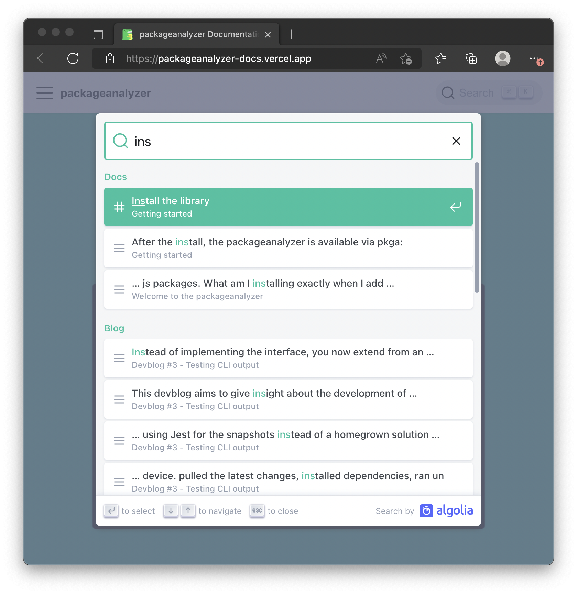

## Introduction
This devblog marks the 1 year devblog anniversary 🎉

Among other things this devblog talks about the new `MultiReport`, how the unit tests randomly broke (again) and the Algolia Search integration.
<!--truncate-->

## Adding `MultiReport` functionality
todo

## Unit Test fixes
todo

## Documentation
The documentation also received some updates:

### Algolia Integration
To help discoverability of the documentation I decided to add Algolia's DocSearch.
Up until now you couldn't search the documentation.

As the documentation is powered by **Docusaurus** it was super easy to add since it comes with Algolia support out of the box.

All that was needed was:
1. Sign up for [Algolia DocSearch](https://docsearch.algolia.com/apply) (It's free for Open Source Projects)
2. Add an `algolia` section to the docusaurus conf:
```javascript title="docusaurus.config.js"
module.exports = {
  // ...
  themeConfig: {
    // ...
    algolia: {
      appId: 'YOUR_APP_ID',
      apiKey: 'YOUR_SEARCH_API_KEY',
      indexName: 'YOUR_INDEX_NAME',
    },
  },
};

```

And with just that you've added search to your documentation:


The search is also responsive with light/dark theme support out of the box 👏

### Up to date documentation
As I added new features and refactored the code, the code examples in the documentation ran out of sync. Now they should be up to date again ✌️

## Next Steps
Employ a steady cadence of devblogs. Writing a devblog is a great way to reflect on the work that was done. More often than not I would revisited a newly added feature because when writing about it, it turned out to be too complex to use.

When you are working on a feature you are totally immersed and everything seems logical but if you re-visit it again in the future, e.g. to write about in a devblog or to write documentation for it you get a much more sober view of the work you did.
Chances are if you write about it and it feels complex, it most likely is. Writing about it is a good reality check.

The next big planned feature is parsing the respective `.tar` archive of a package.

For example it would allow running a static code analyzer on the source code or inspecting the file that was referenced in the `postinstall` command. Coupled with the newly added `MultiReport` this allows more elaborate analysis scenarios.