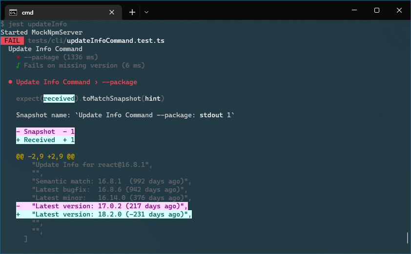
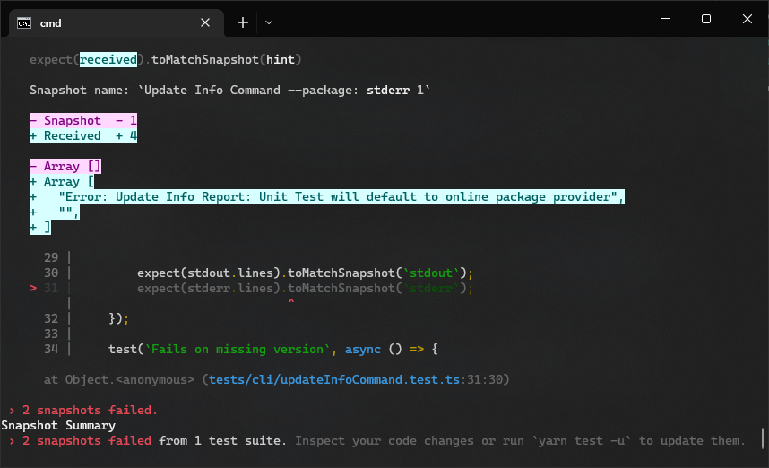
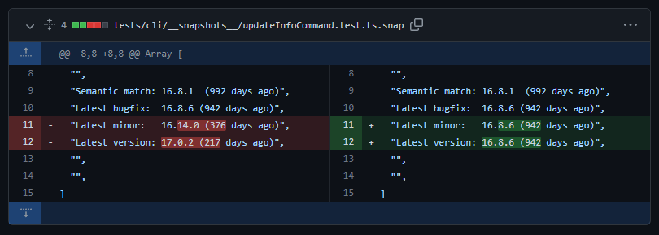

## Introduction

This devblog marks the 1 year devblog anniversary 🎉

Among other things this devblog talks about the new `MultiReport`, how the unit tests randomly broke (again) and the new Algolia Search integration.

<!--truncate-->

:::info
This devblog is about the `packageanalyzer` project.

_A framework to introspect Node.js packages._

Please find a short introduction and the motivation for this project [here](/docs/intro).
:::

## Adding `MultiReport` functionality {#multireport-header}

The main new featue that happened since last time was the addition of a `MultiReport`.

The `MultiReport` lets you inspect 2 or more packages **at the same time**.

### Why

Security is a central tenet of the `packageanalyzer`.
As such there needs to be functionality that let's you directly highlight changes between 2 versions of the same package. E.g. dependency changes, maintainer changes etc. To support this use case the `packageanalyzer` needs to be able to inspect multiple packages at the same time.

Up until now you could only inspect 1 package at a time.
While you could already specify and run different reports in 1 go, they would be totally isolated and independent from each other.

With the `MultiReport` it is now possible to inspect 2 or more packages **at the same time in a single `Report`**.

The implementation was actually fairly easy, since the `Report` feature already existed (although only for 1 package at a time) all that was needed was to call this logic in a loop, to resolve the dependency tree for each specified package and then hand over all resolved dependency trees to the `report` method.

To improve the developer experience the `report` method signature was adapted. Up until now the signature looked like this:

```typescript
report(pkg: Package, context: IReportContext): Promise<void>;
```

The 1st argument was the resolved dependency tree and the 2nd argument contained a `context` object, which housed `stdout` and `stderr` for CLI output.

To accommodate multiple dependency trees the `context` was made the first argument followed then by the dependency tree(s):

```typescript
report(context: IReportContext, pkg1: Package, /*...,*/ pkgN: Package): Promise<void>;
```

This way it's more inline with existing JavaScript API's that also provide arbitrary number of arguments, like [`Function.prototype.bind()`](https://developer.mozilla.org/en-US/docs/Web/JavaScript/Reference/Global_objects/Function/bind)

```javascript
bind(thisArg);
bind(thisArg, arg1, /* …, */ argN);
```

### Usage

To use the new `MultiReport` you just need to specify the package names in the `entries` attribute for which you want to resolve the dependency tree and in the `callback` you can then consume the corresponding resolved dependency trees.

```typescript
const multiReport = new MultiReport({
  entries: [
    [`react`, `18.2.0`],
    [`react`, `17.0.2`],
  ],
  callback: async (
    _ctx,
    pkg1 /* react@18.2.0 dependency tree */,
    pkg2 /* react@17.0.2 dependency tree */
  ) => {
    //todo do something with pkg1 & pkg2
  },
});
```

## Unit Test fixes

As is tradition by now, the Unit Tests broke again randomly:

Here it checks the update command for the latest version of **React**.

The Unit Test is set to a specific date, so no matter when the test is run, it should display _217 days ago_ and the latest version should be _17.0.2_ however the test revealed a negativ time span with the latest version being _18.2.0_ which was released only 2 months ago.

This shouldn't happen as all test data is stored locally. If it was done properly... turns out it wasn't.

This specific Unit Test was still accessing live data from NPM, that's why it was able to (correctly) identify the latest version as _18.2.0_.

Live NPM data in Unit Tests used to be the cause for numerous random test failures, to prevent such errors in the future a safety mechanism was put into place to write to `stderr` in case live NPM data is accessed in a test run. Since `stderr` gets snapshot tested too, it will be easily visible if live NPM data was accessed.

However nothing was written to `stderr` in this case because the live NPM data was accessed via custom logic which circumvented this safety mechanism.

After removing this custom logic to follow the standard way, there was now a message in `stderr` warning that live NPM data was used:


All that was needed now to fix the issue was to provide the correct test data by specifying the correct `Provider` for the Unit Test:

```typescript
//set unit test provider
command.beforeProcess = (report) => (report.provider = provider);
```

However after providing the correct test data, the test still failed:

Turns out that the existing "correct" snapshot is actually also wrong as it too used live NPM data when it was created. The correct version number when using the test data is actually _16.8.6_.

After updating the snapshots, the Unit Test ran fine again, hopefully this was the last test breakage due to live NPM data usage in the Unit Tests 🤞

## Documentation

The documentation also received some updates:

### Algolia Integration

To help discoverability of the documentation I decided to add Algolia's DocSearch.
Up until now you couldn't search the documentation.

As the documentation is powered by **Docusaurus** it was super easy to add since it comes with Algolia support out of the box.

All that was needed was:

1. Sign up for [Algolia DocSearch](https://docsearch.algolia.com/apply) (It's free for Open Source Projects)
2. Add an `algolia` section to the docusaurus conf:

```javascript title="docusaurus.config.js"
module.exports = {
  // ...
  themeConfig: {
    // ...
    algolia: {
      appId: "YOUR_APP_ID",
      apiKey: "YOUR_SEARCH_API_KEY",
      indexName: "YOUR_INDEX_NAME",
    },
  },
};
```

And with that you've added search to your documentation:


The search is also responsive with light/dark theme support out of the box 👏

### Up to date documentation

As I added new features (like the new [`MultiReport`](#multireport-header) and refactored more and more code, the code examples in the documentation ran out of sync. Now they should be up to date again ✌️

## Next Steps

Employ a steady cadence of devblogs. Writing a devblog is a great way to reflect on the work that was done. More often than not I would revisited a newly added feature because when writing about it, it turned out to be too complex to use.

When you are working on a feature you are totally immersed and everything seems logical but if you re-visit it again in the future, e.g. to write about in a devblog or to write documentation for it you get a much more sober view of the work you did.
Chances are if you write about it and it feels complex, it most likely is. Writing about it is a good reality check.

The next big planned feature is parsing the respective `.tar` archive of a package to make the individual files available for processing.

For example it would allow running a static code analyzer on the source code or inspecting the file that was referenced in the `postinstall` command. Coupled with the newly added `MultiReport` this allows for more elaborate analysis scenarios.
