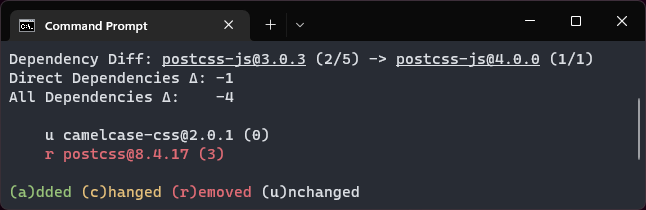
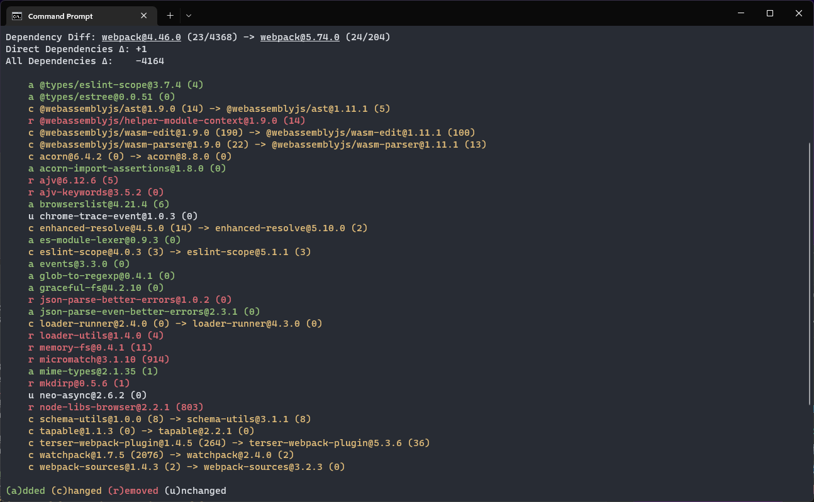
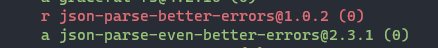

## Introduction

Building on recent work, a new dependency differ functionality was added alongside a new Tar Decorator. To keep up with the ever growing code size many small housekeeping improvements where done to tackle rot.

<!--truncate-->

:::info
This devblog is about the `packageanalyzer` project.

_A framework to introspect Node.js packages._

Please find a short introduction and the motivation for this project [here](/docs/intro).
:::

## Diff Report


Building on the work of the [`MultiReport`](./2022-08-30-devblog6.md#multireport-header) a new functionality was added that allows you to compare the dependencies of 2 packages. Which dependencies got added, removed or changed. In this case between `tailwind@3.0.0` and `tailwind@3.1.8`.

What's interesting is that even though direct dependencies grew by 1, the overall dependency count decreased by 34.

In large parts due to the removal of `cosmiconfig@7.0.1` which came with 23 dependencies and `tmp@0.2.1` which came with 15 dependencies.

We can also see that the update of `postcss-js` resulted in fewer dependencies.

Now we can run the differ against those `postcss-js` versions:

```
packageanalyzer diff --range postcss-js@3.0.3 postcss-js@4.0.0
```



and see that the reduction in dependencies came by removing `postcss` which itself contained 3 dependencies.

In a future revision you might be able to drill down like this automatically.

To finish, here's a nice gem when looking at `webpack 4` and `webpack 5`:

```
packageanalyzer diff --range webpack@4.46.0 webpack
```



`webpack 5` comes with 4k less dependencies than `webpack 4` 😮

While `webpack@4.46.0` came with 4368 dependencies, `webpack@5.74.0` comes with only 204.

Also if you look closely you can see this:



Overall pretty good improvements by the `webpack` devs 😁

It's pretty fun looking at the differences like this, however this is only the first version, lmk if you find it useful or want to see additional info etc.

## Creating Test Scenarios

Up until now, all tests were based on real package data, however with the `Diff Report` it was necessary to create custom test scenarios, like packages with certain removed, added or updated dependencies.

For this reason work was done to easily create those custom test scenarios. It is now possible to provide a custom nested `json` structure which heavily mimics a `package.json` to setup test scenarios.

In fact it's mostly a `package.json` like structure but the `dependencies` field is nested to allow for the creation of custom dependency trees. This data structure is then converted into a *real* `Package` class alongside a corresponding `Provider` that can be used in testing.

Here's a small example how it looks:

[todo code example of mock dependency tree]
```typescript
    const fromBaseData: IMockPackageJson = {
        name: `from`,
        version: `1.0.0`,
        dependencies: [
            { name: `oldDep1`, version: `1.0.0` },
            { name: `oldDep2`, version: `1.0.0` },
            { name: `updatedDep1`, version: `1.0.0` },
            { name: `updatedDep2`, version: `2.0.0` }
        ]
    };

    const toBaseData: IMockPackageJson = {
        name: `to`,
        version: `1.0.0`,
        dependencies: [
            { name: `newDep1`, version: `1.0.0` },
            { name: `newDep2`, version: `1.1.0` },
            { name: `updatedDep1`, version: `2.0.0` },
            { name: `updatedDep2`, version: `3.0.0` }
        ]
    };

    const pkg1: Package = createMockPackage(toBaseData);
    const pkg2: Package = createMockPackage(fromBaseData);
```
Now `pkg1` and `pkg2` can be passed to the diff report to create and test any desired scenario.

## Tar Decorator

todo

## Reworked the dependency dumper

todo

## Housekeeping

## Upgrade to TypeScript 4.8

Well, this project was started to among other things identify packages with a `postinstall` script as these are often used in conjunction with malicious attacks.

Lo and behold the packageanalyzer is now also using its very own `postinstall` script, though I hope only temporary...

This is because the latest TypeScript version broke the `clipanion` dependency which provides the CLI functionality due to [being more restrictive with generics](https://devblogs.microsoft.com/typescript/announcing-typescript-4-8/#unconstrained-generics-no-longer-assignable-to).

In order to not need to wait until `clipanion` is TypeScript 4.8 compatible I simply patched `clipanion` with the [`patch-package`](https://www.npmjs.com/package/patch-package) library.

In the `node_modules` folder I patched `clipanion`, then I told `patch-package` to make a patch file of my changes:

```text title="clipanion+3.2.0-rc.11.patch"
...
--- a/node_modules/clipanion/lib/advanced/options/Array.d.ts
+++ b/node_modules/clipanion/lib/advanced/options/Array.d.ts
-export declare function Array<T = string, Arity extends number = 1>(descriptor: string, opts: ArrayFlags<T, Arity> & {
+export declare function Array<T extends {} = string, Arity extends number = 1>(descriptor: string, opts: ArrayFlags<T, Arity> & {
     required: true;
 }): CommandOptionReturn<Array<WithArity<T, Arity>>>;
 ...
```

 That file is then saved in a `patches` folder. All that is needed then is to define a `postinstall` entry that simply calls `patch-package`:

 ```json title="package.json"
 {
    // ...
   "scripts": {
        "build": "tsc -b",
        "dev": "tsc -b --watch",
        "test:coverage": "jest --coverage",
        "prettier": "prettier --write \"{src,tests,utility}/**/{*.ts,*.js}\" webpack.web.config.js",
        // highlight-next-line
        "postinstall": "patch-package"
    },
    // ...
 }
 ```

 Now if you do `yarn install`, `patch-package` will apply the patch to the `node_modules` folder making `clipanion` work with TypeScript 4.8.


Though I hope this is a temporary solution and in due time `clipanion` natively supports TypeScript 4.8.

### Removed obsolete provider

todo

## What's next

todo
