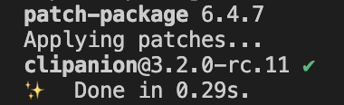

## Introduction

Todo introduction

<!--truncate-->

:::info
This devblog is about the `packageanalyzer` project.

_A framework to introspect Node.js packages._

Please find a short introduction and the motivation for this project [here](/docs/intro).
:::

## Diff Report

todo

## Creating Test Scenarios

todo

## Tar Decorator

todo

## Reworked the dependency dumper

todo

## Housekeeping

## Upgrade to TypeScript 4.8

Well, this project was started to among other things identify packages with a `postinstall` script as these are often used in conjunction with malicious attacks.

Lo and behold the packageanalyzer is now also using its very own `postinstall` script, though I hope only temporary...

This is because the latest TypeScript version broke the `clipanion` dependency which provides the CLI functionality due to [being more restrictive with generics](https://devblogs.microsoft.com/typescript/announcing-typescript-4-8/#unconstrained-generics-no-longer-assignable-to).

In order to not need to wait until `clipanion` is TypeScript 4.8 compatible I simply patched `clipanion` with the [`patch-package`](https://www.npmjs.com/package/patch-package) library.

In the `node_modules` folder I patched `clipanion`, then I told `patch-package` to make a patch file of my changes:

```text title="clipanion+3.2.0-rc.11.patch"
...
--- a/node_modules/clipanion/lib/advanced/options/Array.d.ts
+++ b/node_modules/clipanion/lib/advanced/options/Array.d.ts
-export declare function Array<T = string, Arity extends number = 1>(descriptor: string, opts: ArrayFlags<T, Arity> & {
+export declare function Array<T extends {} = string, Arity extends number = 1>(descriptor: string, opts: ArrayFlags<T, Arity> & {
     required: true;
 }): CommandOptionReturn<Array<WithArity<T, Arity>>>;
 ...
```

 That file is then saved in a `patches` folder. All that is needed then is to define a `postinstall` entry that simply calls `patch-package`:

 ```json title="package.json"
 {
    // ...
   "scripts": {
        "build": "tsc -b",
        "dev": "tsc -b --watch",
        "test:coverage": "jest --coverage",
        "prettier": "prettier --write \"{src,tests,utility}/**/{*.ts,*.js}\" webpack.web.config.js",
        // highlight-next-line
        "postinstall": "patch-package"
    },
    // ...
 }
 ```

 Now if you do `yarn install`, `patch-package` will apply the patch to the `node_modules` folder making `clipanion` work with TypeScript 4.8.



Though I hope this is a temporary solution and in due time `clipanion` natively supports TypeScript 4.8.

### Removed obsolete provider

todo

## What's next

todo
