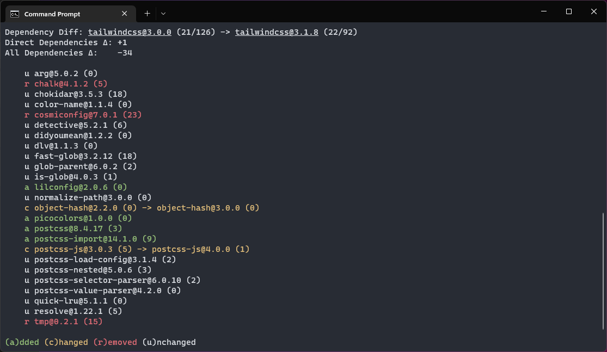
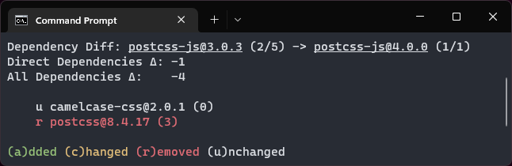
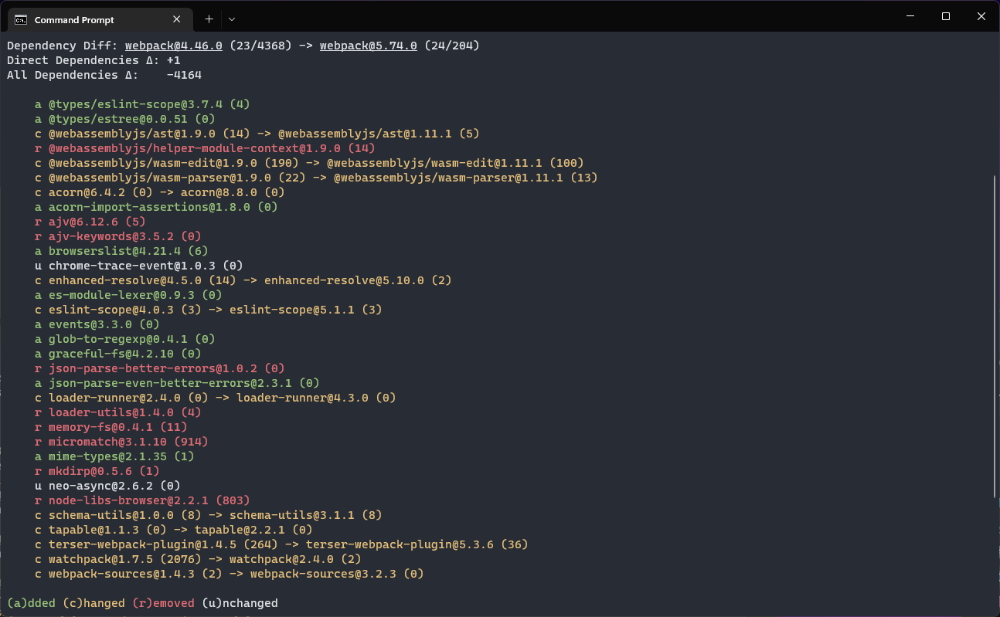
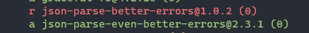
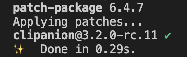

## Introduction

Building on recent work, a new dependency differ functionality was added alongside a new Tar Decorator. To keep up with the ever growing code size many small housekeeping improvements where done to tackle code rot.

<!--truncate-->

:::info
This devblog is about the `packageanalyzer` project.

_A framework to introspect Node.js packages._

Please find a short introduction and the motivation for this project [here](/docs/intro).
:::

## Diff Report



> Changes in (direct) dependencies for `tailwindcss`

Building on the work of the [`MultiReport`](./2022-08-30-devblog6.md#multireport-header) a new functionality was added that allows you to compare the dependencies of 2 packages. Which dependencies got added, removed or changed.

In the picture above you can see the output for `tailwind@3.0.0` and `tailwind@3.1.8`.

What's interesting is that even though direct dependencies grew by 1, the overall dependency count decreased by 34.

In large parts due to the removal of both `cosmiconfig@7.0.1` and `tmp@0.2.1` which came with 23 dependencies and respectively 15 dependencies.

We can also see that the update of `postcss-js` resulted in fewer dependencies.

Now we can run the differ against those `postcss-js` versions:

```
packageanalyzer diff --range postcss-js@3.0.3 postcss-js@4.0.0
```



The reduction in dependencies came by removing `postcss` which itself contained 3 dependencies.

In a future revision you might be able to drill down like this automatically.

To finish, here's a nice gem when looking at `webpack 4` and `webpack 5`:

```
packageanalyzer diff --range webpack@4.46.0 webpack
```



`webpack 5` installs 4k less dependencies than `webpack 4` 😮

While `webpack@4.46.0` installs 4368 dependencies, `webpack@5.74.0` installs only 204.

Also if you look closely you can see this:



Overall pretty good improvements by the `webpack` devs 😁

It's pretty fun looking at the differences like this, however this is only the first version, let me know if you find it useful or want to see additional info etc.

## Creating Test Scenarios

Up until now, all tests were based on real package data, however with the `Diff Report` it was necessary to create custom test scenarios, like packages with certain removed, added or updated dependencies.

For this reason work was done to easily create those custom test scenarios. It is now possible to provide a custom nested `json` structure which heavily mimics a `package.json` to setup test scenarios.

In fact it's mostly a `package.json` like structure but the `dependencies` field is nested to allow for the creation of custom dependency trees. This data structure is then converted into a _real_ `Package` class alongside a corresponding `Provider` that can be used in testing.

Here's a small example how it looks:

```typescript
const fromBaseData: IMockPackageJson = {
  name: `from`,
  version: `1.0.0`,
  dependencies: [
    { name: `oldDep1`, version: `1.0.0` },
    { name: `oldDep2`, version: `1.0.0` },
    { name: `updatedDep1`, version: `1.0.0` },
    { name: `updatedDep2`, version: `2.0.0` },
  ],
};

const toBaseData: IMockPackageJson = {
  name: `to`,
  version: `1.0.0`,
  dependencies: [
    { name: `newDep1`, version: `1.0.0` },
    { name: `newDep2`, version: `1.1.0` },
    { name: `updatedDep1`, version: `2.0.0` },
    { name: `updatedDep2`, version: `3.0.0` },
  ],
};

const pkg1: Package = createMockPackage(toBaseData);
const pkg2: Package = createMockPackage(fromBaseData);
```

Now `pkg1` and `pkg2` can be passed to the diff report to create and test any desired scenario.

## Tar Decorator

This month also saw work on a tar decorator.

A `decorator` is a mechanism to add custom data to a `Package` during dependency lookup. In this case it adds the `tar` file aka the actual files that make up a package.

During dependency lookup it will download the `tar` archive, extract the content (to memory) and make it available for consumption via `.getDecoratorData` e.g.:

```typescript
const { data } = p.getDecoratorData("tar");

// get README.md
const readme: string | undefined = data.get("package/README.md");

if (readme) {
  // do something with the readme...
}
```

The tar decorator is precursory work for static code analysis.

## Housekeeping

### Upgrade to TypeScript 4.8

Well, this project was started to among other things identify packages with a `postinstall` script as these are often used in conjunction with malicious attacks.

Lo and behold the packageanalyzer is now also using its very own `postinstall` script, though I hope only temporary...

This is because the latest TypeScript version broke the `clipanion` dependency which provides the CLI functionality due to [being more restrictive with generics](https://devblogs.microsoft.com/typescript/announcing-typescript-4-8/#unconstrained-generics-no-longer-assignable-to).

In order to not need to wait until `clipanion` is TypeScript 4.8 compatible I simply patched `clipanion` with the [`patch-package`](https://www.npmjs.com/package/patch-package) library.

In the `node_modules` folder I patched `clipanion`, then I told `patch-package` to make a patch file of my changes:

```text title="clipanion+3.2.0-rc.11.patch"
...
--- a/node_modules/clipanion/lib/advanced/options/Array.d.ts
+++ b/node_modules/clipanion/lib/advanced/options/Array.d.ts
-export declare function Array<T = string, Arity extends number = 1>(descriptor: string, opts: ArrayFlags<T, Arity> & {
+export declare function Array<T extends {} = string, Arity extends number = 1>(descriptor: string, opts: ArrayFlags<T, Arity> & {
     required: true;
 }): CommandOptionReturn<Array<WithArity<T, Arity>>>;
 ...
```

That file is then saved in a `patches` folder. All that is needed then is to define a `postinstall` entry that simply calls `patch-package`:

```json title="package.json"
{
  // ...
  "scripts": {
    "build": "tsc -b",
    "dev": "tsc -b --watch",
    "test:coverage": "jest --coverage",
    "prettier": "prettier --write \"{src,tests,utility}/**/{*.ts,*.js}\" webpack.web.config.js",
    // highlight-next-line
    "postinstall": "patch-package"
  }
  // ...
}
```

Now if you do `yarn install`, `patch-package` will apply the patch to the `node_modules` folder making `clipanion` work with TypeScript 4.8.



Though I hope this is only a temporary solution and in due time `clipanion` natively supports TypeScript 4.8.

### Code Rot

With the ever growing code size, focus was also put on removing unnecessary code, to keep the code tidy and maintainable. Many small things were removed or improved.

## What's next

I'm really happy with how the packageanalyzer is turning out to be. However there are still some things I want to improve before going beta namely to improve the user experience for error handling and to improving the documentation and tidy up the git repo (move parts to the documentation). If time allows also maybe look into improving type inference surrounding `Package` and `Decorator`.

`Reports` can take custom input data, ideally if the format is wrong there should be clear error messages indicating the error. This is currently lacking, so focus will be put onto this going forward.

The documentation is also currently lacking behind with all the work that is going on, so focus will also be on rounding out the documentation.
