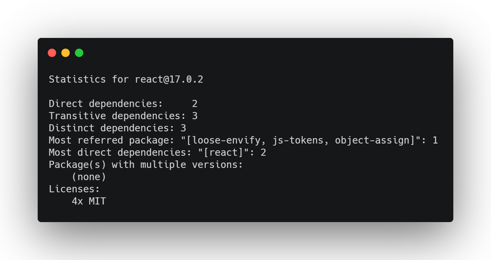

# Analyze 

## Introduction
The `analyze` option lets you quickly introspect a particular Node.js package, e.g.:
```
pkga analyze --package react
```
This command will introspect the latest version of `react`.

## Options
Argument | Description
--- | ---
`--package` | name of package to analyze e.g. `react@17.0.2`, will default to latest version if no version is provided
`--folder` | path to a local `package.json` on the filesystem
`--type` | Which type of dependencies to traverse `dependencies` or `devDependencies`, defaults to `dependencies`
`--full` | Show additional information, like oldest/newest package

## Example Usages
### Analyze a specific version
```bash
pkga analyze --package react@17.0.2
```
### Analyze latest version
```bash
#omit version to default to latest version
pkga analyze --package react
```
### Analyze a local project
```bash
pkga analyze --folder ./path/to/package.json
```