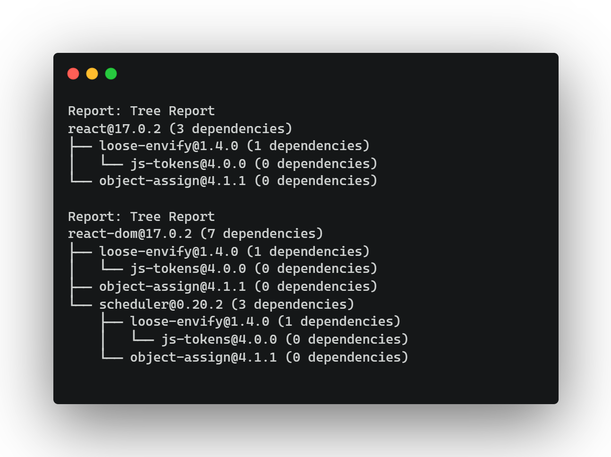

# Report



> Report functionality used run 2 Tree Reports (`react` and `react-dom`)

## Introduction

The `report` option lets you run a custom or a series of custom checks, extending the built in functionality e.g.:

```
pkga report --config ./path/to/report.js
```

Please see [Using Custom Reports](../guides/custom_reports.md) on how to use custom reports.

## Options

| Argument   | Description                                                                |
| ---------- | -------------------------------------------------------------------------- |
| `--config` | path to a `JavaScript` file that contains the custom report config object. |

## Example Usages

### Run a custom report

```
pkga report --config ./path/to/report.js
```
