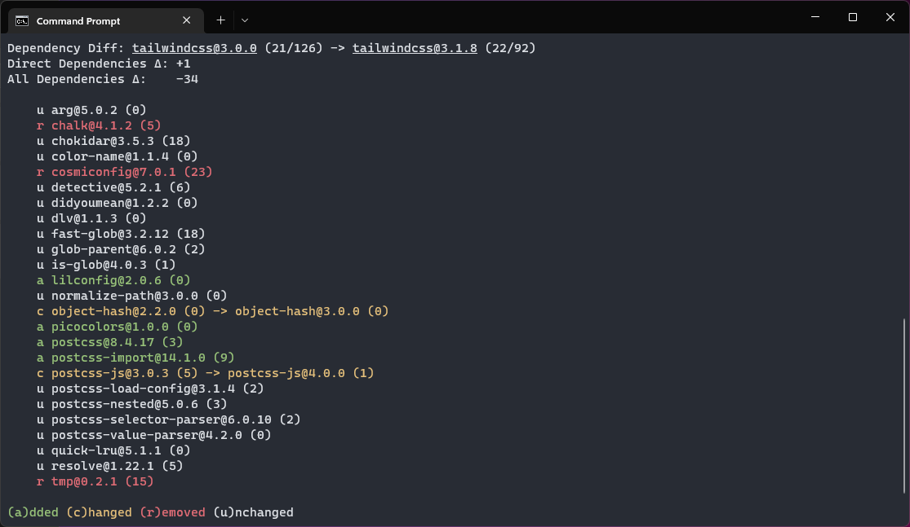

# Diff



## Introduction

The `diff` option lets you compare the dependency tree of 2 packages.

Useful if you want to see which packages got updated, added or removed.

```
pkga diff --range react@16.12.0 react@18.2.0
```

This command will show a diff of the dependency tree between `react@16.12.0` and `react@18.2.0`.

## Options

| Argument           | Description                                                                                                                  |
| ------------------ | ---------------------------------------------------------------------------------------------------------------------------- |
| `--diff $from $to` | compares the dependency tree of `$from` with `$to`.<br />`$to` is optional, it will default to the latest version of `$from` |

## Example Usages

### Show diff between 2 versions

Compare dependencies of `react@16.12.0` with `react@18.2.0`:

```
pkga diff --range react@16.12.0 react@18.2.0
```

### Show diff with latest version

Compare dependencies of `react@16.12.0` with the latest version of `react` at the time:

```
pkga diff --range react@16.12.0
```

If you omit the end range it will default to the latest version.
