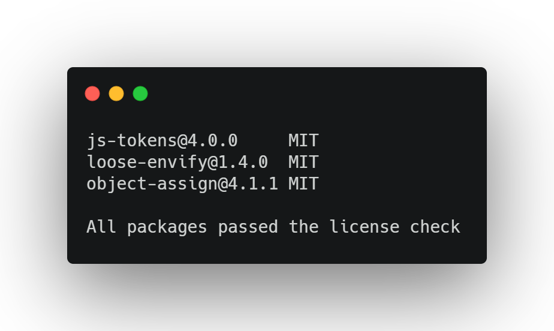

# License 

## Introduction
The `license` option displays all listed licenses in a particular Node.js package, e.g.:
```
pkga license --package react --allow MIT
```
This command will list the licenses for the latest version of `react`.

## Options
Argument | Description
--- | ---
`--package` | name and version of package e.g. `react@17.0.2`, will default to latest version if no version is provided
`--folder` | path to a local `package.json` on the filesystem
`--type` | Which type of dependencies to traverse `dependencies` or 
`--allow` | Define an allowlist that the licenses must fulfill
`--grouped` | Group results by license

## Example Usages
### List licenses
### Define an allowlist
### Group licenses