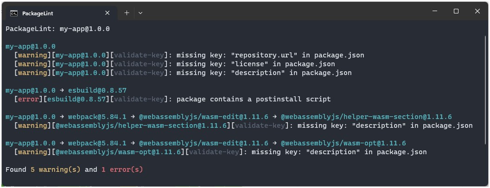

# Lint



## Introduction

The `lint` option lets you define and run checks on the dependency tree.

If an `error` is encountered, the lint process will exit with a non-zero status code.

## Config File

The checks are defined in a config file that needs to be passed to the `lint` command. This file can be a JavaScript or a TypeScript file.

A sample config file in TypeScript could look like this:

```typescript title="lintConfig.ts"
const config = {
    rules: [
        // checks go here
        [
            "warning", // "warning" | "error"
            {
                name: `sample-check`,
                check: (pkg: any) => {
                    const description = pkg.getData("description");

                    if (!description) return `No description found!`;
                }
            }
        ]
    ]
};

export default config;
```

This will surface all dependencies that don't contain a `description` as a `warning`.

For a more in depth explanation of how to write checks, please see [this guide](../../guides/lint_rules.md).

## Options

| Argument    | Description                                                                             |
| ----------- | --------------------------------------------------------------------------------------- |
| `lintFile`  | Path to the config file that contains the checks.                                       |
| `--package` | Package to run the checks on. Defaults to the latest version if no version is provided. |
| `--folder`  | Path to a folder that contains a local `package.json`.                                  |
| `--depth`   | Depth to evaluate. If omitted, it will traverse the whole dependency tree.              |

## Example Usages

### Lint whole dependency tree of latest React version

```
pkga lint ./path/to/lintConfig.ts --package react
```

### Lint React only with specific version

```
pkga lint ./path/to/lintConfig.ts --package react@16.10.2 --depth 0
```

### Lint local project

```
pkga lint ./path/to/lintConfig.ts --folder ./path/to/project
```

## Rules

Currently, there is only one built in rule: the [`Validate Key`](./rule_key_check.md) rule. This rule allows you to check for the existence of certain keys in the `package.json`. Additionally, a custom validator can be provided for more sophisticated checks.

To write custom rules, please see [this guide](../../guides/lint_rules.md).
