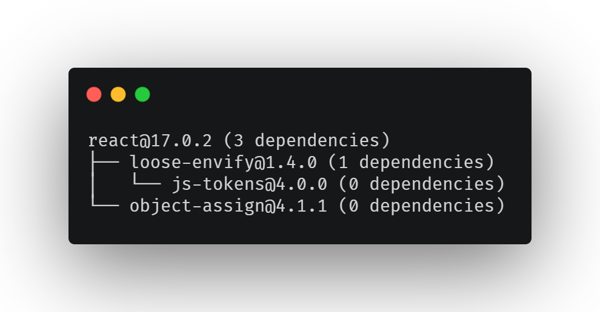

# Tree



## Introduction

The `tree` option will print the dependency tree for a particular Node.js package, e.g.:

```bash
pkga tree --package react
```

This command will print the dependency tree for the latest version of `react`.

## Options

| Argument    | Description                                                                                               |
| ----------- | --------------------------------------------------------------------------------------------------------- |
| `--package` | name and version of package e.g. `react@17.0.2`, will default to latest version if no version is provided |
| `--folder`  | path to a local `package.json` on the filesystem                                                          |
| `--type`    | Which type of dependencies to traverse `dependencies` or                                                  |

## Example Usages

### Print `dependencies` tree for a particular version

```bash
pkga tree --package react@17.0.2
```

### Print `dependencies` tree for latest version

```bash
pkga tree --package react
```

### Print `devDependencies` tree for local project

```bash
pkga tree --package react@17.0.2 --type devDependencies
```
