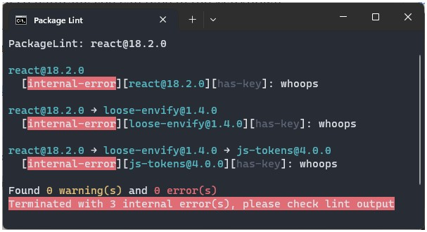
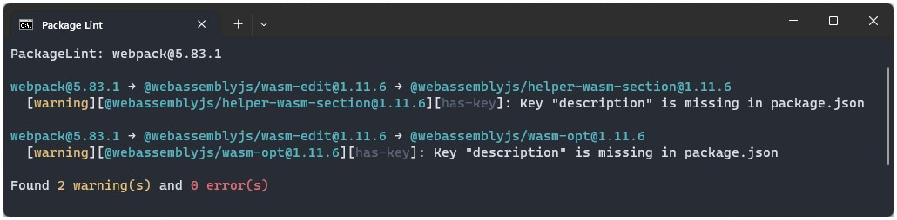

# Writing custom lint rules

You can extend the [`lint`](../cli/lint/index.md) command with custom lint rules.

The rules are configured in a config file of the following format:

```javascript title="lintConfig.js"
module.exports = {
    rules: [
        // rules go here
    ]
};
```

## `rules` array

The `rules` array contains tuples of the following format:

```typescript
type Rule = ["warning" | "error", ILintCheck];
```

The difference between `warning` and `error` is that `error` will exit with an error code > 0 making it suitable to run in CI environments.

## `ILintCheck` Interface

The `ILintCheck` interface defines the actual logic for a given rule. It is called for every package in the dependency tree.

It gets the current package `pkg` and any defined `params`;

To report a violation simply return a `string` or `string[]`;

If you don't return anything, it means the rule passed.

```typescript title="ILintRule"
export interface ILintCheck<T = undefined> {
    name: string; // name of the check
    check: (pkg: Package, params: T) => string | string[] | void; // check callback
}
```

## Throwing exceptions

If you throw an exception inside the lint logic, it will be caught and displayed as `internal-error`. The exit code will also be set to > 0 even if all checks where `warnings`.

```javascript
module.exports = {
    rules: [
        [
            "warning",
            {
                name: `has-key`,
                // @ts-ignore
                check: (pkg, key) => {
                    throw new Error(`whoops`);
                }
            }
        ]
    ]
};
```



## A first rule

### Basic

Let's write a rule that checks if `description` is defined in the `package.json`:

```javascript title="lintConfig.js"
module.exports = {
    rules: [
        [
            "warning",
            {
                name: `has-description`,
                check: pkg => {
                    const description = pkg.getData("description");

                    if (!description) return `No description found!`;
                }
            }
        ]
    ]
};
```

That's all you need to write a simple lint rule. Please see here which methods are available on the [`pkg`](../core_concepts/package.md) object.

### Using parameters

While the above rule certainly works, it's pretty hardcoded, you don't want to repeat that logic if you want to check for the `license`.

In that case we can provide the key as a parameter like so:

```javascript title="lintConfig.js"
module.exports = {
    rules: [
        [
            "warning",
            {
                name: `has-description`,
                // highlight-next-line
                check: (pkg, key) => {
                    const data = pkg.getData(key);

                    if (!data) return `Key "${key}" is missing in package.json`;
                }
            },
            // highlight-next-line
            "description"
        ]
    ]
};
```

Notice the 2nd parameter named `key` in the `check` function.

The 3rd argument in our rule tuple is reserved for parameters that we want to pass into the `check` function.
With this mechanism we can now pass in arbitrary key names allowing us to reuse the rule to check multiple keys:

```javascript title="lintConfig.js"
const hasKey = {
    name: `has-key`,
    check: (pkg, key) => {
        const data = pkg.getData(key);

        if (!data) return `Key "${key}" is missing in package.json`;
    }
};

module.exports = {
    rules: [
        ["warning", hasKey, "description"],
        ["warning", hasKey, "license"]
    ]
};
```

Now we can easily check for the existence of `description` and `license` key in the `package.json`.

If we run it for `webpack@5.83.1` we get the following output:



2 packages in the dependency tree are missing descriptions!
